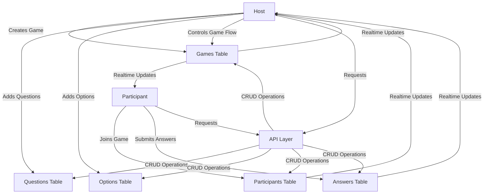
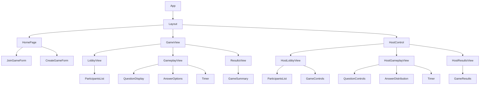

# Karoot! Quiz Application Architecture

## 1. Database Schema Design (Supabase)

### 1.1 Games Table
```sql
CREATE TABLE games (
  id UUID PRIMARY KEY DEFAULT uuid_generate_v4(),
  title TEXT NOT NULL,
  host_id UUID NOT NULL REFERENCES auth.users(id) ON DELETE CASCADE,
  status TEXT NOT NULL CHECK (status IN ('draft', 'lobby', 'in_progress', 'finished')) DEFAULT 'draft',
  code TEXT NOT NULL UNIQUE CHECK (code ~ '^[0-9]{4}$'),
  current_question_index INTEGER DEFAULT 0,
  created_at TIMESTAMP WITH TIME ZONE DEFAULT NOW(),
  updated_at TIMESTAMP WITH TIME ZONE DEFAULT NOW()
);

-- Index for faster lookups by code
CREATE INDEX games_code_idx ON games(code);
-- Index for finding games by host
CREATE INDEX games_host_id_idx ON games(host_id);
```

### 1.2 Participants Table
```sql
CREATE TABLE participants (
  id UUID PRIMARY KEY DEFAULT uuid_generate_v4(),
  game_id UUID NOT NULL REFERENCES games(id) ON DELETE CASCADE,
  name TEXT NOT NULL,
  created_at TIMESTAMP WITH TIME ZONE DEFAULT NOW(),
  -- Ensure participant names are unique within a game
  UNIQUE(game_id, name)
);

-- Index for finding participants by game
CREATE INDEX participants_game_id_idx ON participants(game_id);
```

### 1.3 Questions Table
```sql
CREATE TABLE questions (
  id UUID PRIMARY KEY DEFAULT uuid_generate_v4(),
  game_id UUID NOT NULL REFERENCES games(id) ON DELETE CASCADE,
  text TEXT NOT NULL,
  "order" INTEGER NOT NULL,
  created_at TIMESTAMP WITH TIME ZONE DEFAULT NOW(),
  updated_at TIMESTAMP WITH TIME ZONE DEFAULT NOW(),
  -- Ensure question order is unique within a game
  UNIQUE(game_id, "order")
);

-- Index for finding questions by game
CREATE INDEX questions_game_id_idx ON questions(game_id);
-- Index for ordering questions
CREATE INDEX questions_game_id_order_idx ON questions(game_id, "order");
```

### 1.4 Options Table
```sql
CREATE TABLE options (
  id UUID PRIMARY KEY DEFAULT uuid_generate_v4(),
  question_id UUID NOT NULL REFERENCES questions(id) ON DELETE CASCADE,
  text TEXT NOT NULL,
  is_correct BOOLEAN NOT NULL DEFAULT FALSE,
  created_at TIMESTAMP WITH TIME ZONE DEFAULT NOW(),
  updated_at TIMESTAMP WITH TIME ZONE DEFAULT NOW()
);

-- Index for finding options by question
CREATE INDEX options_question_id_idx ON options(question_id);
-- Index for finding correct options
CREATE INDEX options_question_id_is_correct_idx ON options(question_id, is_correct);
```

### 1.5 Answers Table
```sql
CREATE TABLE answers (
  id UUID PRIMARY KEY DEFAULT uuid_generate_v4(),
  participant_id UUID NOT NULL REFERENCES participants(id) ON DELETE CASCADE,
  question_id UUID NOT NULL REFERENCES questions(id) ON DELETE CASCADE,
  option_id UUID NOT NULL REFERENCES options(id) ON DELETE CASCADE,
  response_time_ms INTEGER,
  created_at TIMESTAMP WITH TIME ZONE DEFAULT NOW(),
  -- Ensure a participant can only answer a question once
  UNIQUE(participant_id, question_id)
);

-- Index for finding answers by participant
CREATE INDEX answers_participant_id_idx ON answers(participant_id);
-- Index for finding answers by question
CREATE INDEX answers_question_id_idx ON answers(question_id);
```

### 1.6 Realtime Subscriptions Setup
Enable Supabase Realtime for the following tables:
- games (for status updates)
- participants (for lobby updates)
- answers (for answer submissions)

## 2. API Routes and Data Flow

### 2.1 API Routes Structure

```
/api/
  /games/
    POST /                 # Create a new game
    GET /:id               # Get game details
    PATCH /:id             # Update game (title, status)
    DELETE /:id            # Delete a game
    
    GET /:id/questions     # Get all questions for a game
    POST /:id/questions    # Add a question to a game
    
    POST /:id/start        # Start a game (change status to in_progress)
    POST /:id/next         # Move to next question
    POST /:id/end          # End a game (change status to finished)
    
  /questions/
    GET /:id               # Get question details
    PATCH /:id             # Update question
    DELETE /:id            # Delete a question
    
    GET /:id/options       # Get options for a question
    POST /:id/options      # Add an option to a question
    
  /options/
    PATCH /:id             # Update option
    DELETE /:id            # Delete an option
    
  /participants/
    POST /                 # Join a game (create participant)
    GET /:id               # Get participant details
    
  /answers/
    POST /                 # Submit an answer
    GET /questions/:id     # Get answer distribution for a question
```

### 2.2 Data Flow Diagram



## 3. Real-time Communication Strategy

### 3.1 Supabase Realtime Channels

We'll use Supabase Realtime for all real-time features, creating specific channels for different aspects of the game:

1. **Game Status Channel**
   - Channel: `game:{game_id}`
   - Purpose: Broadcast game state changes (draft → lobby → in_progress → finished)
   - Events: 
     - `game_status_changed`
     - `current_question_changed`

2. **Participants Channel**
   - Channel: `game:{game_id}:participants`
   - Purpose: Broadcast when new participants join the game
   - Events:
     - `participant_joined`

3. **Answers Channel**
   - Channel: `game:{game_id}:answers`
   - Purpose: Broadcast answer submissions (for host view)
   - Events:
     - `answer_submitted`

### 3.2 Real-time Implementation

```typescript
// Example of setting up Supabase Realtime subscriptions

// Game status subscription
const gameStatusSubscription = supabase
  .channel(`game:${gameId}`)
  .on('postgres_changes', {
    event: 'UPDATE',
    schema: 'public',
    table: 'games',
    filter: `id=eq.${gameId}`
  }, (payload) => {
    // Handle game status changes
    updateGameState(payload.new);
  })
  .subscribe();

// Participants subscription
const participantsSubscription = supabase
  .channel(`game:${gameId}:participants`)
  .on('postgres_changes', {
    event: 'INSERT',
    schema: 'public',
    table: 'participants',
    filter: `game_id=eq.${gameId}`
  }, (payload) => {
    // Handle new participant
    addParticipant(payload.new);
  })
  .subscribe();

// Answers subscription (host only)
const answersSubscription = supabase
  .channel(`game:${gameId}:answers`)
  .on('postgres_changes', {
    event: 'INSERT',
    schema: 'public',
    table: 'answers',
    filter: `question_id=eq.${currentQuestionId}`
  }, (payload) => {
    // Handle new answer submission
    updateAnswerStats(payload.new);
  })
  .subscribe();
```

## 4. Component Structure for Different Game States

### 4.1 Component Hierarchy



### 4.2 State-Specific Components

#### 4.2.1 Draft State Components (Host Only)
- `GameEditor`: Main component for editing game details
  - `GameTitleEditor`: For editing the game title
  - `QuestionsList`: List of questions with edit/delete options
  - `QuestionEditor`: Form for adding/editing questions
  - `OptionsEditor`: Form for adding/editing options for a question
  - `PublishGameButton`: Button to change game state to lobby

#### 4.2.2 Lobby State Components
- **Host View**:
  - `HostLobbyView`: Main component for host in lobby state
    - `ParticipantsList`: List of participants who have joined
    - `GameCodeDisplay`: Display the game code for sharing
    - `StartGameButton`: Button to start the game
    - `GameSettings`: Optional settings for the game

- **Participant View**:
  - `LobbyView`: Main component for participants in lobby state
    - `WaitingScreen`: Display waiting message
    - `ParticipantsList`: List of participants who have joined

#### 4.2.3 In Progress State Components
- **Host View**:
  - `HostGameplayView`: Main component for host during gameplay
    - `QuestionDisplay`: Display current question
    - `AnswerDistribution`: Real-time chart of answer distribution
    - `ParticipantProgress`: Show how many participants have answered
    - `NextQuestionButton`: Button to move to next question
    - `Timer`: Countdown timer for current question

- **Participant View**:
  - `GameplayView`: Main component for participants during gameplay
    - `QuestionDisplay`: Display current question
    - `AnswerOptions`: Grid of answer options (2x2)
    - `Timer`: Countdown timer for current question
    - `FeedbackDisplay`: Show if answer was correct/incorrect

#### 4.2.4 Finished State Components
- **Host View**:
  - `HostResultsView`: Main component for host after game ends
    - `GameSummary`: Summary of game results
    - `QuestionBreakdown`: Breakdown of answers for each question
    - `NewGameButton`: Button to create a new game

- **Participant View**:
  - `ResultsView`: Main component for participants after game ends
    - `CompletionMessage`: Thank you message
    - `PersonalResults`: Summary of participant's answers

## 5. Authentication Approach

### 5.1 Host Authentication
- Use existing Supabase authentication system
- Require login for creating and managing games
- Implement route protection for host-specific routes
- Store host_id in games table to link games to specific hosts

```typescript
// Example of protected route for host
export default async function HostControlPage({ params }: { params: { id: string } }) {
  const supabase = await createClient();
  const { data: session, error } = await supabase.auth.getSession();
  
  if (error || !session?.user) {
    redirect('/auth/login');
  }
  
  // Verify this user is the host of this game
  const { data: game } = await supabase
    .from('games')
    .select('*')
    .eq('id', params.id)
    .eq('host_id', session.user.id)
    .single();
  
  if (!game) {
    // Not the host of this game
    redirect('/');
  }
  
  // Render host control interface
  return <HostControl game={game} />;
}
```

### 5.2 Participant Authentication
- No account required
- Participants join with game code and nickname only
- Create participant record in database
- Use browser session storage to maintain participant identity

```typescript
// Example of participant joining logic
export async function joinGame(gameCode: string, nickname: string) {
  const supabase = createClient();
  
  // Find game by code
  const { data: game, error: gameError } = await supabase
    .from('games')
    .select('id, status')
    .eq('code', gameCode)
    .single();
  
  if (gameError || !game) {
    return { error: 'Game not found' };
  }
  
  if (game.status !== 'lobby') {
    return { error: 'Game is not in lobby state' };
  }
  
  // Create participant
  const { data: participant, error: participantError } = await supabase
    .from('participants')
    .insert({
      game_id: game.id,
      name: nickname
    })
    .select()
    .single();
  
  if (participantError) {
    return { error: 'Nickname already taken' };
  }
  
  // Store participant ID in session storage
  sessionStorage.setItem('participant_id', participant.id);
  sessionStorage.setItem('game_id', game.id);
  
  return { participant };
}
```

## 6. Data Access Layer

To maintain clean separation of concerns, we'll implement a data access layer that handles all interactions with Supabase:

```typescript
// src/lib/data/games.ts
export async function createGame(title: string, hostId: string) {
  const supabase = await createClient();
  
  // Generate a unique 4-digit code
  const code = generateUniqueCode();
  
  const { data, error } = await supabase
    .from('games')
    .insert({
      title,
      host_id: hostId,
      code,
      status: 'draft'
    })
    .select()
    .single();
  
  if (error) throw error;
  return data;
}

// src/lib/data/questions.ts
export async function addQuestion(gameId: string, text: string, order: number) {
  const supabase = await createClient();
  
  const { data, error } = await supabase
    .from('questions')
    .insert({
      game_id: gameId,
      text,
      order
    })
    .select()
    .single();
  
  if (error) throw error;
  return data;
}

// Additional data access functions for all entities
```

## 7. Server Actions (Next.js)
For form submissions and data mutations, we'll use Next.js Server Actions to handle server-side operations securely